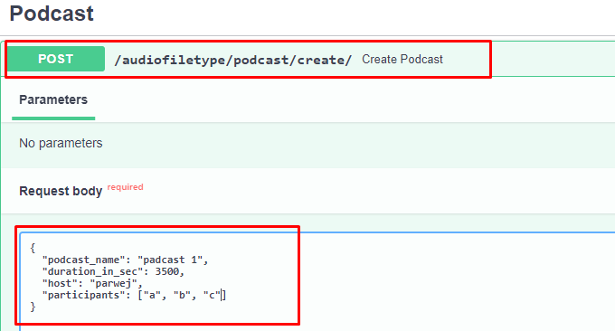

## Created API's for Song file, Podcast file and Audiobook file and performed operation like create, update, delete & read.
### <b>Used--></b> ..... FASTAPI, Pydantic, SqlAlchemy, PostgreSQL, Swagger .....
### <b>run project! --> uvicorn views.audio_type_views:app --reload </b>
  
!!!!!!!!!!!!!!!!!!!!!!!!!!!!!!!!!!!!!!!!!!!!!! <b> Song file API </b>!!!!!!!!!!!!!!!!!!!!!!!!!!!!!!!!!!!!!!!!!!!!!

 

 

 

 

 

  
!!!!!!!!!!!!!!!!!!!!!!!!!!!!!!!!!!!!!!!!!!!!! <b> Podcast file API </b>!!!!!!!!!!!!!!!!!!!!!!!!!!!!!!!!!!!!!!!!!!!!!

 

 

  
!!!!!!!!!!!!!!!!!!!!!!!!!!!!!!!!!!!!!!!!!!!!! <b> AudioBook file API </b>!!!!!!!!!!!!!!!!!!!!!!!!!!!!!!!!!!!!!!!!!!!!!

